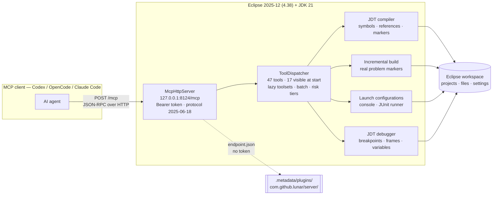

# lunar

**Eclipse IDE MCP server.** Let an AI coding agent build, run, debug and test Java inside your *live* Eclipse workspace.

lunar runs inside Eclipse as five OSGi bundles and exposes the IDE's own state over one authenticated HTTP endpoint: real JDT symbols and references, the real incremental build with its real compiler markers, real launch configurations, real breakpoints and stack frames, and real JUnit counts from the native runner. It registers with the running workspace instead of reimplementing it, and adds **no third-party runtime dependency**.



## Why not just a shell

An agent working on files and a shell cannot know whether its edit compiles, what JDT thinks of a type, which launch config exists, or what the stack looks like two frames into a failure. lunar hands it the same feedback a developer sees in Eclipse.

| | |
|---|---|
| **Protocol** | MCP streamable HTTP, `2025-06-18`, one URL. Not stdio — there is nothing to launch. |
| **Transport auth** | `Authorization: Bearer $ECLIPSE_MCP_TOKEN` on every request, loopback only. A missing token is `401`. |
| **Tools** | 47 total. 17 are visible at start; `load_toolset` exposes the other 30. |
| **Safety** | Every schema carries `x-lunar-risk-tier` (`read`/`build`/`mutate`/`destructive`/`execute`, least to most dangerous), so what a call may do is readable before it runs. |
| **Writes** | `write_file`, `move_file`, `delete_file`, `apply_edit`, `apply_quick_fix` all require the current `read_file` hash as `expectedHash`. |
| **Deps** | None. No Maven, Gradle, Ant or Tycho. Compiled with plain `javac --release 21`. |
| **Platform** | Windows only. |

## Requirements

- **Windows.** The build requires `org.eclipse.swt.win32.win32.x86_64` and resolves it at the highest version the pool carries; the scripts are PowerShell.
- **JDK 21** on `PATH`. Every bundle declares `Bundle-RequiredExecutionEnvironment: JavaSE-21`.
- **Eclipse 2025-12 (4.38).** Bundles need `org.eclipse.core.filebuffers` 3.8.0+, `org.eclipse.core.resources` 3.23.0+, `org.eclipse.core.runtime` 3.34.0+, `org.eclipse.debug.core` 3.23.0+, `org.eclipse.debug.ui` 3.19.0+, `org.eclipse.equinox.app` 1.7.0+, `org.eclipse.jdt.core` 3.44.0+, `org.eclipse.jdt.debug` 3.25.0+, `org.eclipse.jdt.junit.core` 3.14.0+, `org.eclipse.jdt.launching` 3.24.0+, `org.eclipse.osgi` 3.24.0+, `org.eclipse.swt` 3.132.0+, `org.eclipse.text` 3.14.0+, `org.eclipse.ui.console` 3.15.0+, `org.eclipse.ui.workbench` 3.137.0+. The classpath resolves by bundle id and version range, so a pool must carry every floor listed.
- **A bearer token**, in `ECLIPSE_MCP_TOKEN` or `%USERPROFILE%\.lunar\config.json`, set **before** Eclipse starts. At least 32 characters; the server refuses to bind without one, and refuses a shorter one. `lunar.ps1 setup` generates a 64-character one for you.

## Setup

```powershell
# 1. write %USERPROFILE%\.lunar\config.json, generate a token, publish it to user scope
powershell -NoProfile -ExecutionPolicy Bypass -File .\lunar.ps1 setup

# 2. build (javac + 4 check classes) and drop the 5 jars into <eclipse>\dropins
#    add -EclipseHome <dir> unless exactly one eclipse.exe is on PATH
powershell -NoProfile -ExecutionPolicy Bypass -File .\build.ps1 -Install

# 3. register the endpoint with your client
powershell -NoProfile -ExecutionPolicy Bypass -File .\lunar.ps1 connect
```

`-Install` refuses to run while an Eclipse from that installation is alive. It backs up whatever is in `dropins` to `backup\installed-<timestamp>` first.

Then start Eclipse with `-clean -consoleLog` and confirm:

```powershell
powershell -NoProfile -ExecutionPolicy Bypass -File .\lunar.ps1 status
```

`status` reports the resolved token/host/port, whether the variable and the config file agree, where lunar is installed, and whether the port is answering. Three things should agree: the descriptor at `<workspace>\.metadata\plugins\com.github.lunar\server\endpoint.json` exists, port 8124 listens, and an authenticated request answers. A descriptor left behind by an abnormal exit does *not* prove the server is live, so check the other two. Startup errors go to `<workspace>\.metadata\.log`.

`lunar.ps1` has five subcommands — `setup`, `connect`, `status`, `uninstall`, `help`. `help` prints the rest.

`connect` registers with `opencode` by default; `connect -Client codex` registers with Codex. Omitting `-Global` keeps the registration project-scoped, so a shared repository does not decide what its contributors' agents can reach.

### Finding your Eclipse

The build locates Eclipse itself; nothing to edit.

| What | How it is found | Override |
| --- | --- | --- |
| Eclipse | `eclipse.exe` on `PATH`, when exactly one is there | `-EclipseHome <dir>` or `LUNAR_ECLIPSE_HOME` |
| p2 pool | `config.ini`'s `osgi.framework`, then `eclipse.ini`'s `-startup` jar directory and its parent (which is how `<home>/plugins` is found), then `.p2\pool\plugins` | `-PoolDir <dir>` or `LUNAR_POOL_DIR` |

Eclipse does not install itself on `PATH`, so set the variable once:

```powershell
[Environment]::SetEnvironmentVariable('LUNAR_ECLIPSE_HOME', 'C:\path\to\eclipse', 'User')
```

Two installations on `PATH` is an error, not a choice: lunar refuses rather than guess. A missing or too-old bundle is reported by name with the version found.

### Configuration

Three settings, each with an environment variable and a config-file key, read **environment first** so two Eclipse installs can differ on one machine. Blank counts as unset and falls through to the file. All three resolve at startup, so a change needs an Eclipse restart.

| Variable | Key | Default | Notes |
| --- | --- | --- | --- |
| `ECLIPSE_MCP_TOKEN` | `token` | none, **required** | Blank, or under 32 characters, makes the server refuse to bind. |
| `LUNAR_MCP_HOST` | `host` | `127.0.0.1` | Must be loopback. A routable address is refused. |
| `LUNAR_MCP_PORT` | `port` | `8124` | Not 1-65535 is ignored with an Error Log warning. Number or quoted string. |

A malformed config file, or valid JSON that is not an object, is reported in the Error Log and the defaults are used — a typo is never why the endpoint is missing. If the port is taken the server fails loudly and names the variable to change; it never silently picks another.

## Connect your client

Endpoint: `http://127.0.0.1:8124/mcp`. Keep the token in the environment rather than pasting it into a config file. `connect` runs the client's own `add` command when it has one, so the entry is one the client wrote itself.

**Codex** — `~/.codex/config.toml`:

```toml
[mcp_servers.lunar]
url = "http://127.0.0.1:8124/mcp"
bearer_token_env_var = "ECLIPSE_MCP_TOKEN"
```

**OpenCode** — `opencode.json`. V2 nests under `mcp.servers`; V1 puts it directly under `mcp`.

```json
{
  "$schema": "https://opencode.ai/config.json",
  "mcp": {
    "servers": {
      "lunar": {
        "type": "remote",
        "url": "http://127.0.0.1:8124/mcp",
        "oauth": false,
        "headers": { "Authorization": "Bearer {env:ECLIPSE_MCP_TOKEN}" }
      }
    }
  }
}
```

`{env:NAME}` is expanded by OpenCode. `oauth: false` stops it starting an OAuth flow against lunar's static bearer token. Or, project-scoped by default:

```bash
opencode mcp add lunar --url http://127.0.0.1:8124/mcp --header "Authorization=Bearer {env:ECLIPSE_MCP_TOKEN}"
```

**Claude Code** — `.mcp.json`, to keep the token in the environment:

```json
{
  "mcpServers": {
    "lunar": {
      "type": "http",
      "url": "http://127.0.0.1:8124/mcp",
      "headers": { "Authorization": "Bearer ${ECLIPSE_MCP_TOKEN}" }
    }
  }
}
```

`type` is required; without it Claude Code reads the entry as a stdio server. Or let it write the token for you:

```bash
claude mcp add --transport http lunar http://127.0.0.1:8124/mcp --header "Authorization: Bearer $ECLIPSE_MCP_TOKEN" --scope user
```

**Anything else:** point at the URL, declare HTTP, add the header. No command, no working directory, no environment.

## Verify

Ask the agent *"List the projects in the Eclipse workspace."* You should see a `list_projects` call with one entry per project. Or, without an agent:

```powershell
curl.exe -s -X POST http://127.0.0.1:8124/mcp -H "Authorization: Bearer $env:ECLIPSE_MCP_TOKEN" -H "Content-Type: application/json" -H "Accept: application/json, text/event-stream" -d '{\"jsonrpc\":\"2.0\",\"id\":1,\"method\":\"tools/list\",\"params\":{}}'
```

Expect HTTP 200 and 17 tools. Drop the `Authorization` header and you get `401`, which proves the token is enforced.

The escaped `\"` are required on Windows PowerShell 5.1 through 7.3: those versions re-quote the argument as one string for the native process and drop the inner quotes, so the JSON arrives unquoted and the server answers `-32700 parse error`. PowerShell 7.4 is where that stopped mattering — its `Windows` mode still falls back to the old behaviour for `.cmd`, `.bat`, `wscript`, `find.exe` and similar, but `curl.exe` is not on that list and gets a real argument list, so on 7.4+ the plain `'{"jsonrpc"...}'` form works. On 7.3, set `$PSNativeCommandArgumentPassing = 'Standard'` to get it.

This proves the endpoint is reachable and the token is enforced, not that the MCP handshake works: `tools/list` is accepted without a prior `initialize`. A real client sends `initialize` first.

## How to use it

The point is that the agent's feedback loop is the IDE's, so a normal task needs no special instructions. Ask for the change; the agent will call `get_java_symbols` before editing an unfamiliar type, `build_project` and read the marker counts rather than assume a clean compile, `launch` and `get_console_output` for output, and the debug tools for anything that fails at runtime.

Two things worth knowing up front, because they change how the agent should read results:

- `get_problems` reads markers that **already exist** and triggers no build. Call `build_project` for current diagnostics, and read its counts: `built=true` does not mean there were no errors.
- `run_tests` can return `ok=true` with `passed=false`. The tool succeeded at *running* the tests; the tests failed. Check both.

Results that exceed the per-call byte budget are truncated with a session cursor, and `resume_result` pages them; a paged read carries `nextOffset` and continues until `hasMore` is false. `capture_baseline` then `get_delta` compares a retained result against a fresh read, which is cheaper than re-reading a large file to check one value. `batch` runs up to 16 loaded calls in order and stops on the first failure, validating the whole batch before its first side effect.

## Tools

47 total, by toolset: 7 core, 21 workspace, 9 run, 10 debug. The 17 visible at start are the eight tools in the first table plus `project_info`, `list_files`, `read_file`, `search_text`, `get_problems`, `build_project`, `wait_until_quiet`, `list_launch_configs`, `get_console_output`. `load_toolset` with `workspace`, `run`, `debug` or `all` reveals the rest for that session only. A client that caches its tool list must re-read it after a load.

### Core and paging

The seven session tools here are always loaded and never sit behind `load_toolset`. `list_projects` belongs to the `workspace` toolset, but is always visible too.

| Tool | Purpose | Required |
| --- | --- | --- |
| `list_projects` | Every workspace project: path, open state, nature count | none |
| `find_tools` | Rank tools by query, with toolset names | `query` |
| `load_toolset` | Load `workspace`/`run`/`debug`/`all` into this session | `name` |
| `get_session_info` | Loaded tools and remaining output allowance | none |
| `resume_result` | Page a retained truncated result by character offset | `cursor` |
| `capture_baseline` | Retain a loaded read tool's result for later | `tool` |
| `get_delta` | Compare a baseline against a fresh read | `baselineId` |
| `batch` | Up to 16 loaded calls, sequential, stops on first failure | `calls` |

### Files, code and problems

| Tool | Purpose | Required |
| --- | --- | --- |
| `create_project` | Create a project Eclipse knows about, or import from a location | `project` |
| `delete_project` | Close a project and delete it from disk | `project`, `confirm` |
| `project_info` | Natures, builders, auto-build state, JDT configuration | `project` |
| `list_files` | Page files in sorted path order; derived excluded | `project` |
| `read_file` | Saved text or binary hash metadata. UTF-16 offsets, 2 MiB cap, page with `offset`/`nextOffset` until `hasMore` is false | `project`, `path` |
| `create_file` | UTF-8 file plus missing folders. Never overwrites | `project`, `path`, `content` |
| `write_file` | Replace saved text, preserving charset and local history | `project`, `path`, `content`, `expectedHash` |
| `move_file` | Move a file, refusing to overwrite the destination | `project`, `path`, `destination`, `expectedHash` |
| `delete_file` | Delete one file, retaining local history | `project`, `path`, `expectedHash` |
| `apply_edit` | Replace a UTF-16 character range | `project`, `path`, `expectedHash`, `text` |
| `refresh_project` | Refresh the resource model from disk | `project` |
| `search_text` | Literal text search, with explicit skipped-file counts | `project`, `query` |
| `get_java_symbols` | Page JDT types, fields, methods in one compilation unit | `project`, `path` |
| `find_references` | Resolve the symbol at an offset, page sorted JDT references | `project`, `path` |
| `build_project` | Refresh, build synchronously, join native builds, read markers | `project` |
| `build_workspace` | Build every open project, read real markers | none |
| `get_problems` | Page existing markers. Triggers no build | `project` |
| `clear_markers` | Delete matching markers under a project path | `project` |
| `wait_until_quiet` | Wait for builds plus a resource-change quiet window | none |
| `apply_quick_fix` | Persist a current unused/duplicate import correction | `project`, `path`, `markerId`, `expectedHash` |

Every file tool is sandboxed to "the project", so registering a directory as a
project hands the caller that directory. The default allowed root is the
workspace root; `-Dlunar.projectRoots` **replaces** it with your own list, joined
by the platform's path separator (`;` on Windows, `:` elsewhere), which is the
`-D` of the JVM Eclipse is started with — put it in `eclipse.ini`. A root that
does not exist is refused by name, and an ancestor of the workspace or of your
home directory is refused even when named, because a root that contains the
workspace contains everything the agent already has.

### Run, console and tests

| Tool | Purpose | Required |
| --- | --- | --- |
| `list_launch_configs` | Launch ids, types, modes | none |
| `list_launches` | Running and retained launches | none |
| `create_launch_config` | Create a Java application or JUnit config | `name`, `project`, `mainType` |
| `delete_launch_config` | Delete when `confirm` is the exact name | `configuration`, `confirm` |
| `launch` | Build, then launch in run or debug mode | `configuration` |
| `terminate` | Terminate a launch and its debug targets | `launchId` |
| `get_console_output` | Character page of process output, falling back to the console document | `launchId` |
| `get_log_entries` | UTF-8 byte page of the platform log | none |
| `run_tests` | Run an existing JUnit config, returning native counts and traces | `configuration` |

### Debugging

The full loop, driven over the wire: set a breakpoint, launch in debug mode, walk frames, expand variables, step, resume.

| Tool | Purpose | Required |
| --- | --- | --- |
| `list_debug_targets` | Targets and their threads | none |
| `list_breakpoints` | Ids, source locations, enabled state | none |
| `set_breakpoint` | Create or enable a line breakpoint. Give `project` with a project-relative path, or a workspace-absolute `path` alone | `path`, `typeName`, `line` |
| `remove_breakpoint` | Remove by its returned id | `breakpointId` |
| `get_frames` | Frames for a suspended thread, issuing frame handles | `threadId` |
| `get_variables` | Expand one level, with index paths and array paging | `frameId` |
| `continue_execution` | Resume; invalidates frame handles | `threadId` |
| `step_into` / `step_over` / `step_return` | Step and wait for suspension or termination | `threadId` |

`set_breakpoint` is the only tool that addresses a file two ways: give `project` with a project-relative `path`, or a workspace-absolute `path` on its own. Every other tool takes `project` plus a relative path.

## What is unusual about this

Claims below are about lunar's own shipped behaviour. lunar does not publish a
feature-by-feature comparison against other Eclipse MCP servers, and there is
deliberately no such table here: a grid of cells about other people's projects
goes stale the moment any of them changes a line of their README, and a wrong
cell in a comparison table is a public claim about someone else's software.
Compare against their own documentation, linked at the end.

**Writes are guarded by a hash.** Every tool that writes to a file that already
exists takes an `expectedHash` of the content the agent read. If the file
changed since, the call is refused rather than applied over the top. All of them
are workspace tools, the only ones that touch files:

| Tool | Writes | Guard |
|---|---|---|
| `create_file` | new file, refuses to overwrite | n/a, nothing to hash yet |
| `write_file` | full content | `expectedHash` |
| `apply_edit` | a UTF-16 character range | `expectedHash` |
| `move_file` | path | `expectedHash` |
| `delete_file` | path | `expectedHash` |

Note that clients allow and deny by tool name, not by risk tier, so a profile is
a deny list built from `x-lunar-risk-tier`:

| Profile | Denies |
| --- | --- |
| **Reader** | every `mutate`, `destructive` and `execute` name, plus `create_launch_config` |
| **Writer** | every `destructive` and `execute` name |
| **Runner** | nothing; the full 47 |

Two things do not follow from the tier alone. `create_launch_config` is `mutate`
because it writes a file, but a launch configuration is how an agent gets code
to run, so a Reader has to name it. And `execute` is exactly `launch` and
`run_tests` — neither is visible at session start, so a profile that never calls
`load_toolset("run")` cannot reach either one.

**Every schema carries a risk tier**, readable from `tools/list` before any call
runs.

**One endpoint, no runtime dependencies.** No bridge process, no target-platform
download, no Maven, Gradle or Tycho. The five jars go in `dropins` and the
listener answers.

**A debug loop**: line breakpoints, run and debug launch, resume, step
in/over/out, frame handles and variable inspection.

**Lazy toolsets.** 47 tools, 17 visible at start. `load_toolset` reveals the rest
for one session. Clients that cache `tools/list` must re-read it after a load.

**Stated plainly, what is missing.** No refactoring engine, no type or call
hierarchy tools, no active-editor or selection context, no Maven, git or web
tools, no expression evaluation, hot-swap or logpoints. Windows only. No Eclipse
Marketplace listing yet.

## Other Eclipse MCP servers

Worth evaluating against their own documentation, not against this page:

- [AssistAI](https://github.com/gradusnikov/eclipse-chatgpt-plugin) — exposes
  the IDE over five HTTP endpoints, including refactoring, git and debugger
  control.
- [Eclipse MCP Server, vogella](https://github.com/vogellacompany/eclipse-mcp-server)
  — read-mostly IDE introspection with deep JDT search and macOS/Linux support.
- [maxmart/eclipse-mcp-server](https://github.com/maxmart/eclipse-mcp-server) —
  a small Claude Code surface for build, launch and console output.
- [eclipse-agents](https://github.com/eclipse-agents/eclipse-agents) — the
  Eclipse Foundation's MCP and ACP implementation, and an extension point for
  contributing tools.

## Limitations

- Tools read **saved files on disk**, not unsaved editor buffers. Mutating calls reject dirty text and JDT buffers rather than overwrite them.
- `run_tests` needs an **existing** native JUnit config and will not create one.
- `apply_quick_fix` persists only current unused or duplicate import corrections. Anything else returns `unsupported_quick_fix`.
- `delete_project` and `delete_launch_config` refuse unless `confirm` is the exact name.
- Debug frame handles expire with debug state. Re-read frames after every resume, step or termination, and take every id from the tool that issued it.
- Retained stdout and stderr are **concatenated, not interleaved**. Log offsets are UTF-8 bytes; other offsets are UTF-16 characters.
- Bounds: 1 MiB request body, three tool calls running at once with a fourth queued for up to 10 s (only a caller that cannot get a slot in that time gets `429` with `Retry-After: 1`), and at most eight retained results sharing 2 MiB per session. Implementation bounds, not a load-test claim.
- Every client sees the same catalog. Nothing is special-cased by client name or version.
- `-InstallP2` publishes a p2 site but there is still no Tycho build; the default `-Install` just puts jars in `dropins`.

## Install as a p2 update site

`build.ps1 -InstallP2` publishes into `site\` and installs through the p2 director, generating `feature.xml` and `category.xml` from the manifests. No Tycho or PDE build, so the feature is *generated* — p2 reads a feature entry's version as an **exact** match, not a floor, so a stale value publishes and installs nothing. Each jar is named `<id>_<version>.jar` to match. The p2 applications boot this Eclipse installation, which activates the bundle; lunar detects a p2 build application by its `-application` id and stays dormant instead of binding an endpoint nothing can reach, so the log stays clean.

Two things to know before choosing this over `-Install`:

- **The two routes are mutually exclusive.** A p2 install lands in the pool while `dropins` is read separately, and Eclipse reports the bundle as installed from two locations. `-InstallP2` refuses while lunar jars are in `dropins`.
- **A rebuild at the same version will not reinstall.** p2 treats the same id and version as the same artifact and exits 0 having done nothing, so `-InstallP2` checks the jars actually landed in the pool and fails loudly when they did not. Bump `Bundle-Version` in `bundles\*\META-INF\MANIFEST.MF` to cut a new one. For iterating on code, use `-Install`.

## Doing it by hand

Every step the scripts take has a hand equivalent. Write `%USERPROFILE%\.lunar\config.json` first — a partial file is fine, because setup completes one key at a time and treats a key that is present but blank as unset:

```json
{
  "token": "",
  "host": "127.0.0.1",
  "port": 8124
}
```

Fill `token` with at least 32 characters. To make one without `lunar.ps1`:

```powershell
$b = New-Object byte[] 32
[System.Security.Cryptography.RandomNumberGenerator]::Create().GetBytes($b)
$token = -join ($b | ForEach-Object { '{0:x2}' -f $_ })   # 64 hex characters
```

Publish the token to the **user** environment *before* Eclipse starts; a running Eclipse holds the old value, so every request is a `401` until it restarts. Then build, **stop Eclipse**, copy the five `com.github.lunar.*.jar` files into `<eclipse>\dropins`, and restart it.

## Removing it

```powershell
powershell -NoProfile -ExecutionPolicy Bypass -File .\lunar.ps1 uninstall
```

Removes the bundles from `dropins` and uninstalls the p2 feature if that is how it was installed. It refuses while an Eclipse from that installation is running, because removing a jar out from under a live Eclipse leaves lunar answering in the running instance and gone from disk for the next one. Stop Eclipse first.

Without `-Force` the config file and token stay, so `status` still works. With `-Force` they go too, the config file renamed to `config.json.bak` rather than deleted, since the token inside cannot be handed back to whatever client was using it.

`uninstall` does not know which client you registered, so remove that yourself (`opencode mcp remove lunar`, or delete the `lunar` entry from your client config).

By hand: delete `com.github.lunar.*.jar` from `<eclipse>\dropins`, and for a p2 install run the director's own uninstall:

```powershell
.\eclipse\eclipsec.exe -nosplash -consoleLog -application org.eclipse.equinox.p2.director -repository file:/D:/path/to/lunar/site -destination D:\path\to\eclipse -profile <profile> -uninstallIU com.github.lunar.feature.feature.group
```

p2 leaves files on disk at uninstall by design, so a restart is required either way.

## Contributing

```powershell
powershell -NoProfile -ExecutionPolicy Bypass -File .\build.ps1
powershell -NoProfile -ExecutionPolicy Bypass -File .\check-env.ps1
```

`build.ps1` takes four mode switches: no switch, `-Install`, `-InstallP2` and `-NoInstall`. Only `-Install` and `-InstallP2` touch your Eclipse; both refuse to run while an Eclipse from that installation is alive. `-NoInstall` is accepted as an explicit "do not install" and is rejected alongside `-Install`; it changes nothing, checks-only is what an absent install switch already means. `-EclipseHome` and `-PoolDir` override discovery (see [Finding your Eclipse](#finding-your-eclipse)). A build with no install switch writes only `out\` and `build-state.json`; `-Install` also writes `backup\installed-<ts>\` and your Eclipse's `dropins`, and `-InstallP2` also writes `site\`. `.gitignore` covers all four.

`build.ps1` compiles everything with `javac --release 21`, runs four check classes (`SelfCheck`, `ProtocolCheck`, `FrameworkCheck`, `IntegrationCheck`) and fails on any compile error or check failure. It records jar paths, sizes and SHA-256 hashes in `build-state.json` and gates packaging on a check against the jars that were actually produced.

`check-env.ps1` needs no Eclipse. Run it if you touched a script: it dot-sources `lunar.ps1`, exercises four of the five subcommands — all but `help` — against a temporary user profile with the environment accessors replaced, and asserts that the minimum versions in `build.ps1` still match what the bundle manifests declare, so the two cannot drift. It reads `build-state.json` and asserts it names five jars, so run `build.ps1` first or it fails on a fresh clone. Nothing it does writes to the registry or your real `%USERPROFILE%\.lunar`.

CI does exactly this on a clean clone: [`.github/workflows/build.yml`](.github/workflows/build.yml) unpacks the Eclipse 4.38 SDK drop, builds with `-NoInstall`, then runs `check-env.ps1`, and fails the job if either fails. Report vulnerabilities per [SECURITY.md](SECURITY.md).

## License

MIT. See [LICENSE](LICENSE).

lunar contains no copied third-party source and derives from no other open source project. It compiles against Eclipse platform bundles (`org.eclipse.*`, EPL) and the JDK; neither is redistributed here.
